# PhotoChrome — визуальные референсы UI

Дата исследования: 2 октября 2026. Только ресерч; макеты и реализация не выполнялись. Репозиторий не клонировался и не запускался. Функциональная модель PhotoChrome взята из задания пользователя, исходники не проверялись.

## Основной вывод

Быстрый выбор плёнки лучше строить вокруг крупного кадра и короткой ленты превью. Advanced — отдельная сессия с live preview и явными Apply / Cancel; на desktop ей подходит инспектор, на touch — нижняя панель. Светлая оболочка вполне совместима с приоритетом изображения: Apple Photos, Wix и Visual Electric дают разные варианты этого решения. Конкретные предложения ниже — гипотезы для PhotoChrome, а не подтверждённое поведение конкурентов.

## Источники, метод и ограничения

- MCP Mobbin доступен: `search_screens` вернул изображения, идентификаторы и точные ссылки. В подборке 10 экранов оттуда, platform — iOS или web по метаданным MCP.
- MCP scrn доступен: проверены `search`, `list_screens`, `get_app`, `get_screens`. В подборке 2 экрана. Карточки Pool и Telegram имеют `latest: null`, то есть текущие карточки каталога; даты версий — 2026-09-09 и 2026-03-15. Платформа iOS установлена по App Store-ссылкам карточек и видимому системному UI.
- Все 12 сохранённых экранов просмотрены визуально. Изображения скачаны с `image_url` Mobbin и `original_url` scrn; низкокачественные inline-превью не использованы как файлы. В отчёте — относительные пути, постоянные ссылки ведут на конкретные экраны каталогов. Снимки могут отражать прошлые версии продуктов; версия iOS и даты съёмки Mobbin в ответах не сообщены.
- Поиск scrn по VSCO, Lightroom, Darkroom, Snapseed, Polarr, Photomator дал 0 результатов для каждого имени. Повтор по коротким `VS` и `Light` не нашёл нужных редакторов. По `photo` найдены в основном просмотр/загрузка; через тег Media Editor найдено 61 изображение, выборочно просмотрены 9. Два выбранных примера — узкие паттерны из соседних категорий, не аналоги полного редактора.
- Mobbin-запросы с именами Lightroom и Snapseed вернули другие продукты. Это не доказательство отсутствия кандидатов в каталоге. Отобраны фактические продукты из ответов; Darkroom, Polarr и Photomator в Mobbin отдельно не исследованы. Задание покрыто несколькими другими продуктами, а не полным сравнением всех кандидатов.
- Выдача не всегда надёжна: два desktop-экрана с `app_name: Magnific` визуально выглядели как иной canvas-редактор; их исключили из итоговой подборки из-за сомнения в атрибуции. Не относящиеся к задаче экраны также исключены.
- Статичные снимки подтверждают расположение, текст и видимые состояния. Они не подтверждают работу жестов, откат Cancel, сохранение Apply, скорость preview или поведение batch. Видеозаписи flow не изучались.
- Пробелы материала: не найден прямой референс desktop batch-действий, demo из трёх фото, редактора рецептов выбранной плёнки и полноценного видеоэкспорта. Эти части ниже опираются на требования продукта и требуют отдельной проверки при проектировании.

## Карта подборки

| № | Продукт | Источник / платформа | Состояние и паттерн | Значимость |
|---|---|---|---|---|
| 01 | VSCO | Mobbin / ios | [Выбор плёнки и избранное](https://mobbin.com/screens/e6aa14d1-453c-476f-9d84-a699915b04b0) | Лучший |
| 02 | VSCO | Mobbin / ios | [Ручная настройка HSL](https://mobbin.com/screens/10d1f57a-0f28-4083-8b0e-b332535f3d44) | Лучший |
| 03 | VSCO | Mobbin / ios | [Экспорт и рецепт как разные действия](https://mobbin.com/screens/aafba881-e93a-4f69-b623-2f4b160e3914) | Дополнительный |
| 04 | Apple Photos | Mobbin / ios | [Светлый выбор фильтров](https://mobbin.com/screens/1a3464f9-d5e6-4b3a-a8d1-1411eff8a26e) | Лучший |
| 05 | Apple Photos | Mobbin / ios | [Геометрия в светлой оболочке](https://mobbin.com/screens/5bcf365a-c53b-471d-95e5-08dc4d9fa79d) | Дополнительный |
| 06 | Halide Mark III | Mobbin / ios | [Плёнка плюс одна быстрая настройка](https://mobbin.com/screens/298d9809-7e34-4cb6-9c07-4a0fa712c8ba) | Дополнительный |
| 07 | Google Photos | Mobbin / ios | [Видео в той же модели корректировки](https://mobbin.com/screens/f1d8e9d6-b472-40a2-856a-d80de1db0572) | Дополнительный |
| 08 | Wix | Mobbin / web | [Desktop: явная сессия настройки](https://mobbin.com/screens/a8e60fba-9237-48fb-bb45-c29d3767d529) | Лучший |
| 09 | Visual Electric | Mobbin / web | [Desktop: правый инспектор](https://mobbin.com/screens/b4020498-30e7-400d-b0ab-ea4051dbb9c0) | Дополнительный |
| 10 | Krea AI | Mobbin / web | [Сравнение до/после в большом кадре](https://mobbin.com/screens/eb8205ef-590e-47d7-8ca8-08423d4c18bd) | Лучший |
| 11 | Pool | scrn / ios | [Светлый crop и возврат к оригиналу](https://scrn.gallery/app/pool?screen=6aa134645dc87eaf95725745) | Дополнительный |
| 12 | Telegram | scrn / ios | [Явное подтверждение качества результата](https://scrn.gallery/app/telegram?screen=69ba393c34684ff4143c2e01) | Дополнительный |

## 01. VSCO — Выбор плёнки и избранное

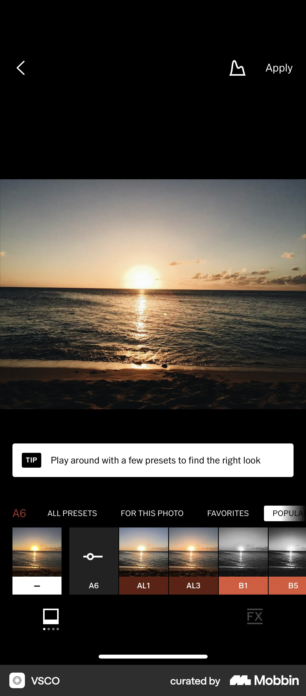

**Источник:** Mobbin. **Продукт:** VSCO. **Платформа:** ios. **Точная ссылка:** [открыть экран](https://mobbin.com/screens/e6aa14d1-453c-476f-9d84-a699915b04b0).

**Состояние:** Редактор; A6 выбран, открыта лента пресетов, видны All Presets / For This Photo / Favorites и подсказка.

**Наблюдение:** Большой кадр над компактной горизонтальной лентой. В карточках показано то же фото; выбранная A6 заменена карточкой с символом регулировки. Названия и выбранное состояние различимы.

**Полезно PhotoChrome:** Сделать Original + 10 базовых плёнок главным быстрым действием. Использовать один и тот же кадр для превью, постоянный порядок, имя плёнки и заметный selection. Избранное перенести внутрь Advanced согласно продуктовой модели.

**Не переносить / граница доказательства:** Не переносить множество категорий, PRO-маркировку, upsell и постоянно видимую обучающую плашку. Один кадр не доказывает, что повторное нажатие открывает настройки.

## 02. VSCO — Ручная настройка HSL

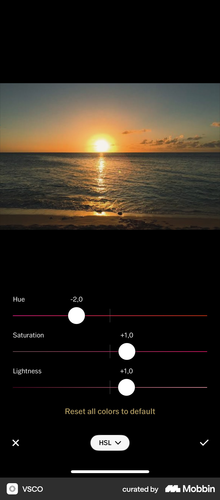

**Источник:** Mobbin. **Продукт:** VSCO. **Платформа:** ios. **Точная ссылка:** [открыть экран](https://mobbin.com/screens/10d1f57a-0f28-4083-8b0e-b332535f3d44).

**Состояние:** Открыт HSL: Hue −2,0; Saturation +1,0; Lightness +1,0; Reset all colors to default; крест и галочка.

**Наблюдение:** Три подписанных слайдера с числами и центральными отметками, изображение остаётся видимым сверху; подтверждение и отмена находятся внизу.

**Полезно PhotoChrome:** Основа touch Advanced: короткая группа контролов с числом, понятным нулём и локальным Reset. Распространить структуру на тон, цвет, детализацию, зерно и WB. В PhotoChrome явно подписать Apply и Cancel, сохраняя live preview.

**Не переносить / граница доказательства:** Не оставлять только иконки для критичных действий. Не делать HSL главным экраном и не копировать узкие треки. По статичному экрану нельзя подтвердить сохранение или откат изменений.

## 03. VSCO — Экспорт и рецепт как разные действия

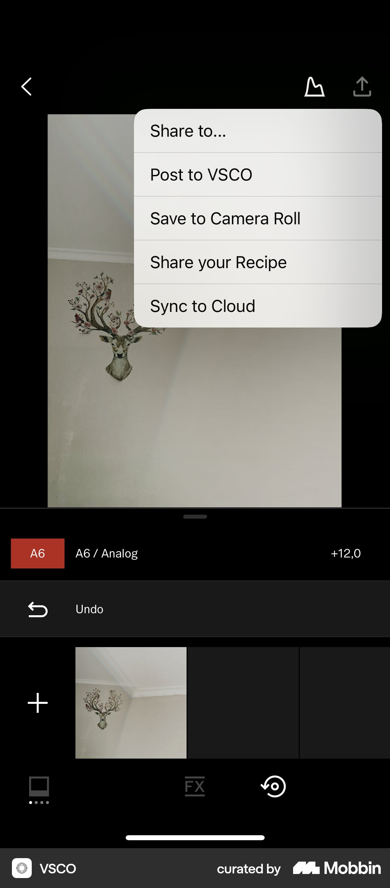

**Источник:** Mobbin. **Продукт:** VSCO. **Платформа:** ios. **Точная ссылка:** [открыть экран](https://mobbin.com/screens/aafba881-e93a-4f69-b623-2f4b160e3914).

**Состояние:** Открыто меню Share to… / Post to VSCO / Save to Camera Roll / Share your Recipe / Sync to Cloud; под фото видны A6 / Analog +12,0 и Undo.

**Наблюдение:** Результат остаётся на экране, а операции с изображением и рецептом представлены отдельными пунктами. Рецепт имеет собственное действие.

**Полезно PhotoChrome:** Развести Apply для Advanced и Export для файла. Использовать краткое резюме выбранной плёнки/рецепта; на desktop указывать, экспортируется текущий файл или выделенная группа.

**Не переносить / граница доказательства:** Не копировать социальную публикацию, облачную синхронизацию и Camera Roll как термин веб-продукта. Это меню действий, не экран параметров экспорта; формат, разрешение, прогресс и видеоэкспорт здесь не показаны.

## 04. Apple Photos — Светлый выбор фильтров

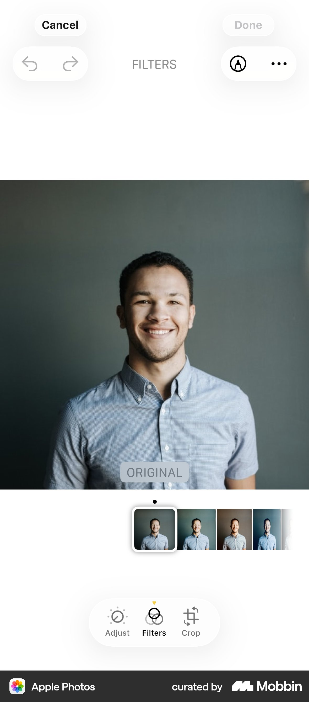

**Источник:** Mobbin. **Продукт:** Apple Photos. **Платформа:** ios. **Точная ссылка:** [открыть экран](https://mobbin.com/screens/1a3464f9-d5e6-4b3a-a8d1-1411eff8a26e).

**Состояние:** Filters; выбран Original; Done выглядит неактивной, Cancel доступен; снизу Adjust / Filters / Crop.

**Наблюдение:** Белая оболочка, изображение во всю ширину, маленькая центрированная лента миниатюр, выделенная Original и её текстовая подпись. Режимы собраны в компактную нижнюю панель.

**Полезно PhotoChrome:** Светлое направление может оставлять фото главным. Сохранить видимое имя выбранной плёнки и Original, а быстрые режимы Film / Advanced / Geometry объединить общей системой обозначений для desktop и touch.

**Не переносить / граница доказательства:** Не переносить полупрозрачный декор буквально и не делать 11 плёнок слишком маленькими. Состояние Done видно, но причина его недоступности по снимку не подтверждена. Этот экран не подтверждает жест сравнения.

## 05. Apple Photos — Геометрия в светлой оболочке

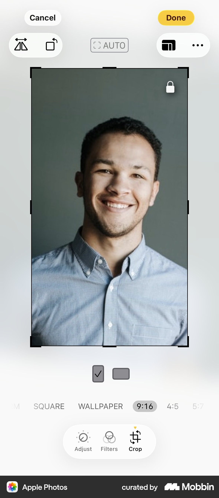

**Источник:** Mobbin. **Продукт:** Apple Photos. **Платформа:** ios. **Точная ссылка:** [открыть экран](https://mobbin.com/screens/5bcf365a-c53b-471d-95e5-08dc4d9fa79d).

**Состояние:** Crop; выделена пропорция 9:16, видны рамка, замок, Cancel / Done, кнопки flip/rotate и список пропорций.

**Наблюдение:** Кадр занимает центр, пропорции расположены под ним, преобразования вынесены наверх. Crop отмечен в общей панели режимов.

**Полезно PhotoChrome:** Держать пропорции рядом с рамкой; угол, zoom, rotate и flip объединить в Geometry. На touch использовать компактную панель под кадром; на desktop те же имена и порядок контролов в инспекторе.

**Не переносить / граница доказательства:** Не копировать платформенные иконки без подписей и слишком бледные соседние ratios. Нельзя считать, что на этом снимке представлены все нужные PhotoChrome контролы: отдельные угол и zoom не показаны.

## 06. Halide Mark III — Плёнка плюс одна быстрая настройка

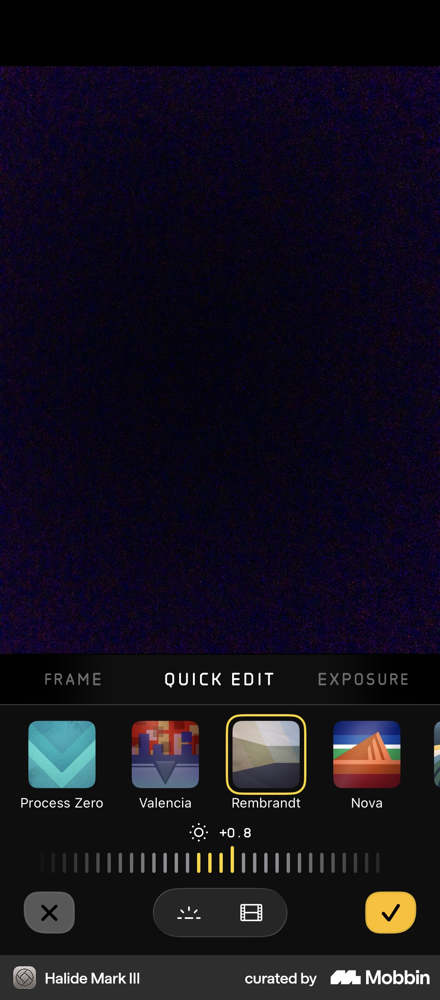

**Источник:** Mobbin. **Продукт:** Halide Mark III. **Платформа:** ios. **Точная ссылка:** [открыть экран](https://mobbin.com/screens/298d9809-7e34-4cb6-9c07-4a0fa712c8ba).

**Состояние:** Halide Mark III; Quick Edit; Rembrandt выбран среди Process Zero / Valencia / Rembrandt / Nova; показана экспозиция +0.8, крест и жёлтая галочка.

**Наблюдение:** Крупный preview, короткая лента визуальных вариантов, одна шкала под ней и акцент только на выбранном варианте/подтверждении.

**Полезно PhotoChrome:** Гипотеза компактного touch-панельного режима: плёнка и её главный параметр остаются рядом, более глубокие настройки уходят в Advanced. Акцентный цвет обозначает состояние, а не украшает всю оболочку.

**Не переносить / граница доказательства:** Не переносить camera-first термины или вкладку Exposure в основной маршрут PhotoChrome без проверки. Шкала экспозиции не является доказательством регулировки силы плёнки. Тёмный исходный кадр затрудняет оценку эффекта.

## 07. Google Photos — Видео в той же модели корректировки

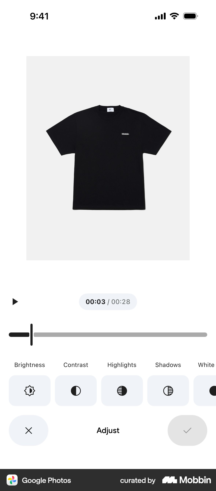

**Источник:** Mobbin. **Продукт:** Google Photos. **Платформа:** ios. **Точная ссылка:** [открыть экран](https://mobbin.com/screens/f1d8e9d6-b472-40a2-856a-d80de1db0572).

**Состояние:** Google Photos; видео 00:03 / 00:28, кнопка Play; Adjust; выбран Brightness, рядом Contrast / Highlights / Shadows / White…; крест и галочка.

**Наблюдение:** Светлый фон, кадр сверху, время и воспроизведение отдельно от шкалы настройки, горизонтальный список параметров снизу.

**Полезно PhotoChrome:** Использовать общий язык Film / Advanced / Geometry для фото и видео. Показывать play и timecode рядом с видео; корректировку отделять от транспорта и подтверждать через Apply.

**Не переносить / граница доказательства:** Не смешивать скраббер воспроизведения со слайдером настройки. Здесь видна одна шкала корректировки, но нет подтверждённой полноценной timeline. Параметры и состояния экспорта видео не показаны.

## 08. Wix — Desktop: явная сессия настройки

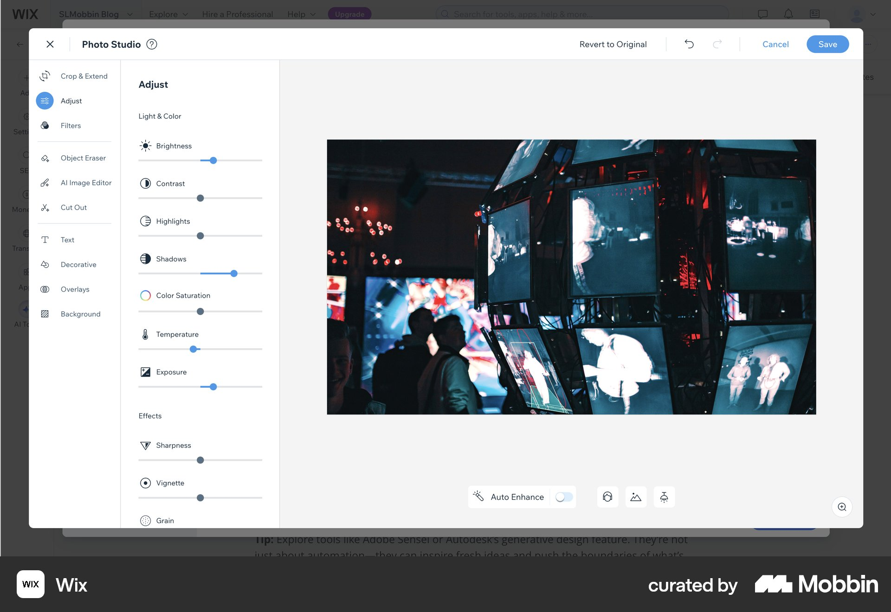

**Источник:** Mobbin. **Продукт:** Wix. **Платформа:** web. **Точная ссылка:** [открыть экран](https://mobbin.com/screens/a8e60fba-9237-48fb-bb45-c29d3767d529).

**Состояние:** Wix Photo Studio; открыт Adjust; слева инструменты и Light & Color / Effects, сверху Revert to Original / undo / redo / Cancel / Save.

**Наблюдение:** Светлая рабочая область с крупным фото, списком регулировок brightness, contrast, highlights, shadows, saturation, temperature, exposure; ниже sharpness, vignette, grain.

**Полезно PhotoChrome:** Сильный референс desktop Advanced: сгруппированные параметры, фото рядом и постоянные действия Apply / Cancel. Revert to Original отличать от Reset текущей группы и отмены всей сессии.

**Не переносить / граница доказательства:** Не переносить двойную левую навигацию, AI/text/decorative tools и модальную оболочку поверх сайта. Список можно сократить до существующих функций. Наличие Cancel / Save не доказывает детали транзакционной модели Wix.

## 09. Visual Electric — Desktop: правый инспектор

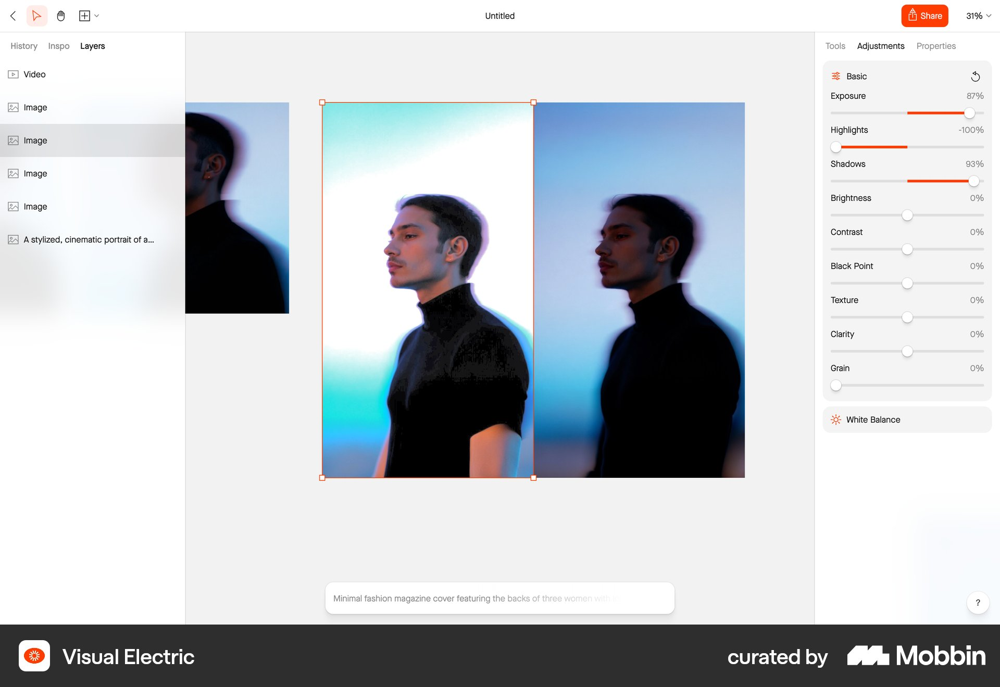

**Источник:** Mobbin. **Продукт:** Visual Electric. **Платформа:** web. **Точная ссылка:** [открыть экран](https://mobbin.com/screens/b4020498-30e7-400d-b0ab-ea4051dbb9c0).

**Состояние:** Visual Electric; выбран объект; открыта Adjustments, группа Basic и свёрнутая White Balance; слева Layers.

**Наблюдение:** Светлый canvas, справа числовые слайдеры Exposure / Highlights / Shadows / Brightness / Contrast / Black Point / Texture / Clarity / Grain; белый инспектор отделён от серого canvas.

**Полезно PhotoChrome:** Правый инспектор Advanced позволяет кадру оставаться в центре и группировать настройки. Для PhotoChrome вместо Layers нужна коллекция изображений; числа и порядок групп совпадают с touch.

**Не переносить / граница доказательства:** Не переносить свободный canvas, слойную модель, выделение объекта с рамкой и генеративный prompt. На снимке нет Apply / Cancel: их надо добавить из требований PhotoChrome, а не приписывать референсу.

## 10. Krea AI — Сравнение до/после в большом кадре

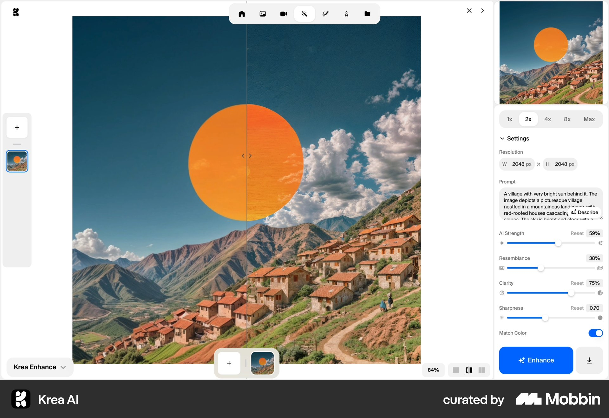

**Источник:** Mobbin. **Продукт:** Krea AI. **Платформа:** web. **Точная ссылка:** [открыть экран](https://mobbin.com/screens/eb8205ef-590e-47d7-8ca8-08423d4c18bd).

**Состояние:** Krea AI; Enhance; фото с центральным вертикальным разделителем и ручкой; справа settings, внизу Enhance и download-иконка.

**Наблюдение:** Разделитель проходит по одному большому изображению; справа компактная панель Resolution и числовых настроек, слева узкая полоса файлов.

**Полезно PhotoChrome:** Референс размещения before/after: сохранить один масштаб и позицию кадра; сравнение сделать временным режимом рядом с изображением. Для desktop можно проверить draggable divider, для touch — явную кнопку Original и удержание как дополнение.

**Не переносить / граница доказательства:** Не переносить AI Strength / Resemblance / prompt / upscaling и яркий Enhance. Статичный снимок подтверждает divider, но не механику перетаскивания. Противоположные состояния изображения не подписаны: в PhotoChrome нужны Original / Preview.

## 11. Pool — Светлый crop и возврат к оригиналу

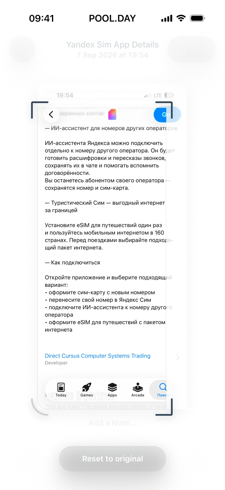

**Источник:** scrn. **Продукт:** Pool. **Платформа:** ios. **Точная ссылка:** [открыть экран](https://scrn.gallery/app/pool?screen=6aa134645dc87eaf95725745).

**Состояние:** Pool; редактирование скриншота, рамка с четырьмя угловыми ручками, область вне рамки осветлена; Reset to original снизу.

**Наблюдение:** Светлый редактор выделяет границу crop затемнёнными уголками и приглушает исключаемое содержимое. Reset остаётся отдельным действием.

**Полезно PhotoChrome:** Дополнительный референс геометрии: приоритет рамки и недвусмысленный возврат к оригиналу. Полезен для проверки светлого варианта PhotoChrome на изображениях с белыми краями.

**Не переносить / граница доказательства:** Не копировать почти белую маску: светлые фото могут потерять границы. Pool организует скриншоты, это не плёночный редактор. На снимке не видны ratios, угол, Apply / Cancel или zoom. Reset crop не должен молча сбрасывать цвет.

## 12. Telegram — Явное подтверждение качества результата

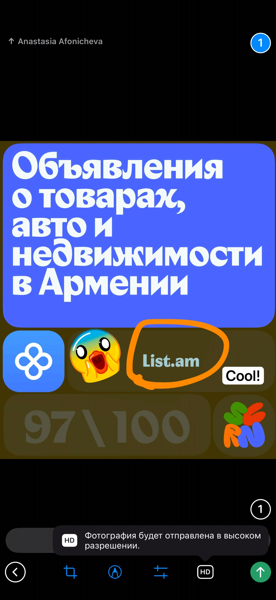

**Источник:** scrn. **Продукт:** Telegram. **Платформа:** ios. **Точная ссылка:** [открыть экран](https://scrn.gallery/app/telegram?screen=69ba393c34684ff4143c2e01).

**Состояние:** Telegram; редактор вложения перед отправкой; выбран HD, видна подсказка «Фотография будет отправлена в высоком разрешении».

**Наблюдение:** Изображение доминирует; HD стоит в нижней строке инструментов, его состояние пояснено текстом прямо после выбора.

**Полезно PhotoChrome:** Для экспорта PhotoChrome показывать качество/размер понятным текстом и подтверждать выбранное состояние, особенно на touch. В batch явно назвать количество файлов, в видео — итоговое разрешение и длительность.

**Не переносить / граница доказательства:** Не переносить Send, подпись сообщения, стикеры или механику мессенджера. HD не заменяет реальные параметры экспорта: формат, размер, codec, прогресс и ошибка на этом экране отсутствуют.

## Пять лучших референсов

| Референс | Почему выбран | Конкретное применение |
|---|---|---|
| [01 — VSCO](https://mobbin.com/screens/e6aa14d1-453c-476f-9d84-a699915b04b0) | Наиболее близок к главному сценарию выбора плёнки; кадр и обработанные миниатюры | Основной Film picker; у PhotoChrome всего 11 постоянных вариантов |
| [02 — VSCO HSL](https://mobbin.com/screens/10d1f57a-0f28-4083-8b0e-b332535f3d44) | Короткая группа ручных контролов с числами, Reset и парой отмена/подтверждение | Touch Advanced; добавить текстовые Apply / Cancel |
| [04 — Apple Photos](https://mobbin.com/screens/1a3464f9-d5e6-4b3a-a8d1-1411eff8a26e) | Светлая оболочка сохраняет иерархию кадр → фильтр → инструменты | Самостоятельное светлое направление, без обязательного чёрного интерфейса |
| [08 — Wix](https://mobbin.com/screens/a8e60fba-9237-48fb-bb45-c29d3767d529) | Desktop-настройки организованы рядом с кадром; видимы Cancel / Save | Desktop Advanced с постоянными Apply / Cancel и группами контролов |
| [10 — Krea AI](https://mobbin.com/screens/eb8205ef-590e-47d7-8ca8-08423d4c18bd) | Сравнение помещается в самом крупном кадре | Проверить режим Original / Preview в одном масштабе без второго окна |

## Три гипотезы направления UI

### A. Тёмная плёночная лаборатория

Опоры: [VSCO Film](https://mobbin.com/screens/e6aa14d1-453c-476f-9d84-a699915b04b0), [VSCO HSL](https://mobbin.com/screens/10d1f57a-0f28-4083-8b0e-b332535f3d44), [Halide Quick Edit](https://mobbin.com/screens/298d9809-7e34-4cb6-9c07-4a0fa712c8ba).

Визуальный характер: нейтральный графит, мало линий, один небольшой акцент на выбранной плёнке и Apply. Главная структура — изображение и лента Original + 10 плёнок. Имена читаются постоянно; без категорий и карточек PRO.

Desktop: крупный кадр, плёнки под ним, Advanced раскрывает правый инспектор; коллекция файлов отдельной компактной лентой. Touch: та же лента и терминология, Advanced заменяет её нижней панелью, оставляя достаточно места кадру. Рецепты выбранной плёнки и избранное находятся внутри Advanced выше ручных групп. Apply / Cancel постоянно видны в этой сессии.

Demo: переключатель трёх фотографий и базовые плёнки; загрузка своих файлов открывает полные инструменты. Видео добавляет play/timecode, сохраняя ту же оболочку. Batch-инструменты появляются при выделении нескольких desktop-файлов и явно показывают область применения.

Почему проверять: ближе всего к основному плёночному сценарию. Риск: тёмный UI может скрывать границы тёмных кадров; нужны нейтральный контур canvas и проверка контраста контролов. Критерий: можно быстро сравнить все плёнки, не входя в Advanced; Apply и Export не путаются.

### B. Светлый фотостол с инспектором

Опоры: [Apple Photos Filters](https://mobbin.com/screens/1a3464f9-d5e6-4b3a-a8d1-1411eff8a26e), [Apple Photos Crop](https://mobbin.com/screens/5bcf365a-c53b-471d-95e5-08dc4d9fa79d), [Wix Adjust](https://mobbin.com/screens/a8e60fba-9237-48fb-bb45-c29d3767d529), [Visual Electric](https://mobbin.com/screens/b4020498-30e7-400d-b0ab-ea4051dbb9c0).

Визуальный характер: белые панели, нейтральный светло-серый canvas, тонкие разделители, компактные подписи. Светлая оболочка самостоятельна; изображение отделяется от белого окружения нейтральной подложкой.

Desktop: центральный кадр, коллекция слева или снизу, один правый инспектор Film / Advanced / Geometry. Film остаётся быстрым доступом, Advanced группирует рецепты, избранное и настройки; без двойной навигации Wix и Layers Visual Electric. Touch: эти разделы переходят в компактную нижнюю панель, а активный раздел раскрывает sheet. Порядок параметров и названия совпадают.

В Geometry видны ratios, угол, zoom, rotate, flip. Advanced имеет явные Apply / Cancel, а Export живёт в общей верхней строке. Batch получает отдельную строку «Выбрано N», видео — транспорт под кадром. В demo видны три фото и Film; остальные разделы доступны после загрузки собственных файлов, с понятным объяснением этого перехода.

Почему проверять: подходит для длительной работы и понятной desktop-структуры. Риск: белая оболочка влияет на восприятие очень светлых фото, а инспектор может съесть ширину кадра. Критерий: крупный кадр сохраняется на типичном ноутбуке, а белые края фото и crop не растворяются.

### C. Просмотрщик с контекстными инструментами

Опоры: [Krea Compare](https://mobbin.com/screens/eb8205ef-590e-47d7-8ca8-08423d4c18bd), [Google Photos Video](https://mobbin.com/screens/f1d8e9d6-b472-40a2-856a-d80de1db0572), [Apple Photos Filters](https://mobbin.com/screens/1a3464f9-d5e6-4b3a-a8d1-1411eff8a26e), [Pool Crop](https://scrn.gallery/app/pool?screen=6aa134645dc87eaf95725745).

Визуальный характер: почти полноэкранный кадр на нейтральном сером фоне; компактная светлая панель инструментов у края. Панели появляются по задаче, а их позиции стабильны. Это иной способ организации рабочего пространства, не просто новая цветовая тема.

Desktop: Film drawer раскрывает 11 плёнок; Advanced временно занимает боковую область, Geometry — небольшую панель под кадром. Touch: Film drawer становится нижней лентой, Advanced и Geometry — sheets с явным завершением. В Advanced рецепты/избранное находятся над настройками; Apply / Cancel закреплены и не скрываются вместе с общими controls.

Сравнение Original / Preview включается в самом кадре; divider на desktop и явно доступная кнопка на touch — гипотезы, требующие проверки. Коллекция файлов компактна, batch-панель появляется по выделению. Видео получает play/timecode у кадра; экспорт отдельным действием с текстовым подтверждением качества. Demo начинается с просмотра трёх фото и Film; загрузка раскрывает полный набор.

Почему проверять: максимальный приоритет изображения и согласованная модель фото/видео. Риск: скрытые инструменты хуже обнаруживаются и плавающие панели могут закрывать важную часть кадра. Критерий: новый пользователь находит Advanced и Geometry без обучения, а панели не перекрывают crop и сравнение.

## Что сохранить в любой гипотезе

Эти условия взяты из задания PhotoChrome, а не из поведения референсов:

1. Original + 10 базовых плёнок — быстрый основной маршрут. У выбранной плёнки всегда видимое имя и selection; превью показывают текущий кадр.
2. Advanced содержит рецепты выбранной плёнки, избранное и группы тон / цвет / детализация / зерно / баланс белого. Изменения показываются на кадре до сохранения; Apply фиксирует сессию, Cancel возвращает предыдущее состояние. Reset отдельной группы не равен Cancel.
3. Geometry объединяет crop, пропорции, угол, zoom, rotate и flip. Не растягивать этот набор на несвязанные экраны.
4. Desktop photo collection и batch должны явно различать текущий файл и выделенную группу. Сохранение настроек и экспорт файлов — разные действия.
5. Для видео сохраняется общий язык редактора, добавляются воспроизведение и экспорт. Прогресс, завершение и ошибка экспорта потребуют отдельного исследования.
6. Demo даёт попробовать плёнки на трёх фото. Переход к своим файлам открывает полные инструменты и должен быть понятен без большого onboarding.

## Рекомендуемый следующий шаг

В другом чате сравнить три направления на одном и том же наборе состояний: demo, выбранная плёнка, Advanced с несохранёнными изменениями, Cancel / Apply, crop, desktop multi-select и видео с экспортом. В качестве первой пары для сравнения взять A и B: они сильнее всего опираются на прямые референсы редактирования. C оставить смелой гипотезой про пространство и обнаруживаемость инструментов.

Отдельно добрать реальные flow для рецептов, batch и экспорта видео. Не считать галочки на статичных изображениях доказательством транзакционной модели. Архив содержит этот файл и 12 оригинальных скриншотов; внешние ссылки нужны только для перехода к источникам, сами изображения доступны офлайн.
